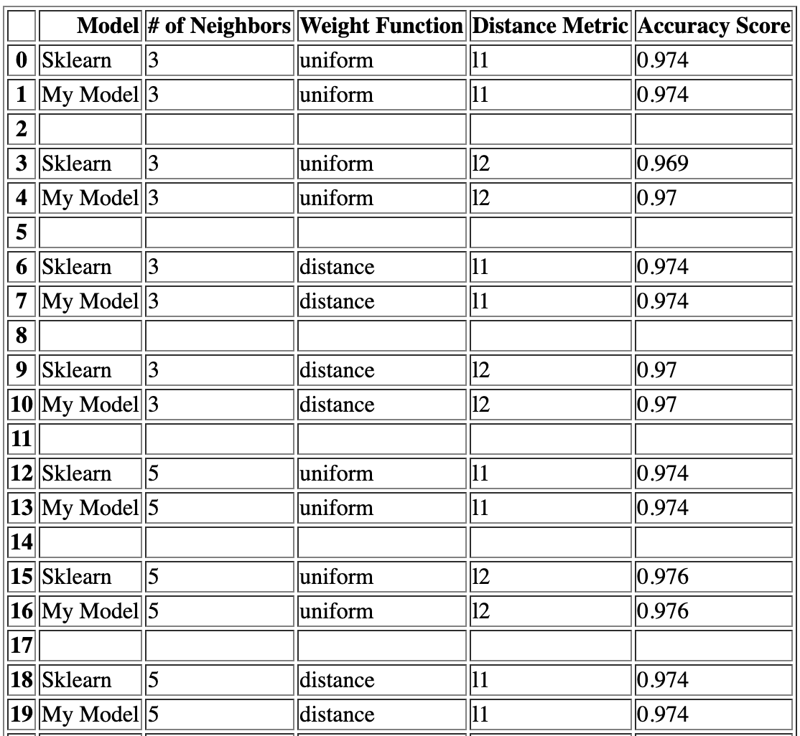
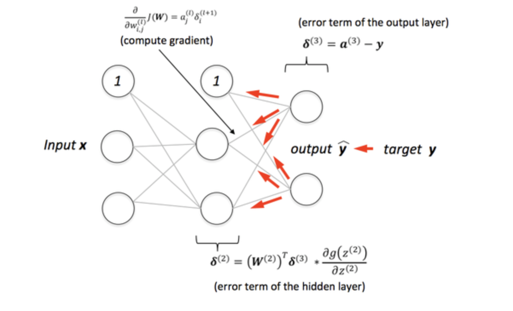

# Part 1: K-Nearest Neighbors Classification

In the machine learning world, k-nearest neighbors is a type of non-parametric supervised machine learning algorithm that is used for both classification and regression tasks. For classification, the principle behind k-nearest neighbors is to find k training samples that are closest in distance to a new sample in the test dataset, and then make a prediction based on those samples.

These k closest neighbors are used to try and predict the correct discrete class for a given test sample. This prediction is typically done by a simple majority vote of the k nearest neighbors of each test sample; in other words, the test sample is assigned the data class which has the most representatives within the k nearest neighbors of the sample. An alternative method for prediction is to weigh the neighbors such that the nearer neighbors contribute more to the fit than do the neighbors that are further away. For this, a common choice is to assign weights proportional to the inverse of the distance from the test sample to the neighbor. The distance can, in general, be any metric measure, but the standard Euclidean distance and Manhattan distance metrics are the most common choices. k-nearest neighbors is also known as a non-generalizing machine learning method since it simply “remembers” all of its training data as opposed to other methods that update specific coefficients that fit a model to the training data.

k-nearest neighbors is also known as a non-generalizing machine learning method since it simply “remembers” all of its training data as opposed to other methods that update specific coefficients that fit a model to the training data.

**What to Do?** -  Your goal in this part is to implement a k-nearest neighbors classifier from scratch. Your GitHub repository contains the skeleton code for two files that will be used to implement the algorithm: utils.py and k_nearest_neighbors.py.

The utils.py file contains helpful utility functions that will be used by the machine learning algorithms. For this part, the only functions you need to concern yourself with are the functions euclidean_distance and manhattan_distance.

The k_nearest_neighbors.py file defines the KNearestNeighbors class that we will use to implement the algorithm from scratch. As you can see, the __init__ function has already been properly implemented for you. This function is run whenever a new KNearestNeighbors object is created, and it checks the arguments passed in for the parameters in addition to setting up the class attributes based on those arguments. The attributes for the class itself are described in detail in the skeleton code. When creating the KNearestNeighbors object, the following parameters must be specified (or their default values will be used):
* **n_neighbors**: the number of neighbors a sample is compared with when predicting target class values (analogous to the value k in k-nearest neighbors).
* **weights**: represents the weight function used when predicting target class values (can be either ‘uniform’ or ‘distance’). Setting the parameter to ‘distance’ assigns weights proportional to the inverse of the distance from the test sample to each neighbor.
* **metric**: represents which distance metric is used to calculate distances between samples. There are two options: ‘l1’ or ‘l2’, which refer to the Manhattan distance and Euclidean distance respectively.

The four functions that must be implemented and their descriptions are as follows:
* **euclidean_distance(x1, x2) in utils.py**: computes and returns the Euclidean distance between two vectors.
* **manhattan_distance(x1, x2) in utils.py**: computes and returns the Manhattan distance between two vectors.
* **fit(X, y) in k_nearest_neighbors.py**: fits the model to the provided data matrix X and targets y.
* **predict(X) in k_nearest_neighbors.py**: The most similar neighbors collected from the training dataset can be used to make predictions. Predicts class target values for the given test data matrix X using the fitted classifier model.

To test your k-nearest neighbors implementation, enter the command shown below on the terminal.
```
python3 main.py knn
```
## Solution

The given problem statement can be solved by following the below implementation steps -
1. Load the data
2. Calculate the distance between test data and each row of training data. Here we are using Euclidean or Manhattan distance as our distance metric
3. Take the most frequent class for the K-Nearest neighbours.

### Algorithm

1. **Calculate Distance**: Get the point distance between each training row and the test row using either Euclidean or Manhattan distance formula.
2. **Get Nearest Neighbors** : Neighbors for a new piece of data in the dataset are the k closest instances, as defined by our distance measure.
 * sort the distances between test and train points and store their index in a list
 * for the test row, get the labels of each neighbours wrt the sorted index in distance array
3. **Make Predictions** : assign the label that occurs in maximum neighbors

* Euclidean Distance formula : np.sqrt(np.sum((np.array(X1) - np.array(X2))x2))
* Manhattan Distance formula : sum(abs(np.array(X1)-np.array(X2)))

### **Sample Output**

```
prataprc94@Prataps-MacBook-Pro prroyc-a4 % python3 main.py knn                  
Loading the Iris and Digits Datasets...

Splitting the Datasets into Train and Test Sets...

Standardizing the Train and Test Datasets...

Testing K-Nearest Neighbors Classification...
 - Iris Dataset Progress:   [============================================================] 100%
 - Digits Dataset Progress: [============================================================] 100%

Exporting KNN Results to HTML Files...

Done Testing K-Nearest Neighbors Classification!

Program Finished! Exiting the Program...
```
The above execution generates two html output files for both iris and digit dataset which are somewhat looks like this-

**knn - iris dataset prediction**


**knn - digit dataset prediction**



# Part 2: Multilayer Perceptron Classification

The building blocks for neural networks are neurons, which are simple computational units that have input signals and produce an output signal using an activation function. Each input of the neuron is weighted with specific values, and while the weights are initially randomized, it is usually the goal of training to find the best set of weights that minimize the output error. The weights can be initialized randomly to small values, but more complex initialization schemes can be used that can have significant impacts on the classification accuracy of the models. A neuron also has a bias input that always has a value of 1.0 and it too must be weighted. These weighted inputs are summed and passed through an activation function, which is a simple mapping that generates an output value from the weighted inputs. Some common activation functions include the sigmoid (logistic) function, the hyperbolic tangent function, or the rectified linear unit function.

These individual neurons are then arranged into multiple layers that connect to each other to create a network called a neural network (or multilayer perceptron). The first layer is always the input layer that represents the input of a sample from the dataset. The input layer has the same number of nodes as the number of features that each sample in the dataset has. The layers after the input layer are called hidden layers because they are not directly exposed to the dataset inputs. The number of neurons in a hidden layer can be chosen based on what is necessary for the problem. The neurons in a specific hidden layer all use the same activation function, but different layers can use different ones. Multilayer perceptrons must have at least one hidden layer in their network.

The final layer is called the output layer and it is responsible for outputting values in a specific format. It is common for output layers to output a probability indicating the chance that a sample has a specific target class label, and this probability can then be used to make a final clean prediction for a sample. For example, if we are classifying images between dogs and cats, then the output layer will output a probability that indicates whether dog or cat is more likely for a specific image that was inputted to the neural network. The nature of the output layer means that its activation function is strongly constrained. Binary classification problems have one neuron in the output layer that uses a sigmoid activation function to represent the probability of predicting a specific class. Multi-class classification problems have multiple neurons in the output layer, specifically one for each class. In this case, the softmax activation function is used to output probabilities for each possible class, and then you can select the class with the highest probability during prediction.

Before training a neural network, the data must be prepared properly. Frequently, the target class values are categorical in nature: for example, if we are classifying pets in an image, then the possible target class values might be either dog, cat, or goldfish. However, neural networks usually require that the data is numerical. Categorical data can be converted to a numerical representation using one-hot encoding. One-hot encoding creates an array where each column represents a possible categorical value from the original data (for the image pet classification, one-hot encoding would create three columns). Each row then has either 0s or 1s in specific positions depending on the class value for that row. 

In this assignment, we will specifically be focusing on multilayer perceptron neural networks that are feedforward, fully-connected, and have exactly three layers: an input layer, a hidden layer, and an output layer. A feedforward fully-connected network is one where each node in one layer connects with a certain weight to every node in the following layer. A diagram of such a neural network is shown below, where the input layer has five nodes corresponding to five input features, the hidden layer has four neurons, and the output layer has three neurons corresponding to three possible target class values. The bias terms are also added on as nodes named with subscript of b.


Once the data is prepared properly, training occurs using batch gradient descent. During each iteration, **forward propagation** is performed where training data inputs go through the layers of the network until an output is produced by the output layer. Frequently, the cross-entropy loss is calculated using this output and stored in a history list that allows us to see how quickly the error reduces every few iterations. The output from the output layers is then compared to the expected output (the target class values) and an error is calculated. The output error is then propagated back through the network one layer at a time, and the weights are updated according to the amount that they contributed to the error. This is called **backward propagation**. A parameter called the learning rate is typically used to control how much to change the model in response to the estimated error each time the model weights are updated. Once the maximum number of iterations is reached, the neural network is finished training and it can be used to make new predictions. A prediction is made by using new test data and computing an output using **forward propagation**. When there are multiple output neurons, the output with the highest softmax value is chosen as the predicted target class value.

**What to Do?** -  The goal in this part is to implement a feedforward fully-connected multilayer perceptron classifier with one hidden layer (as shown in the description above) from scratch. As before, your GitHub repository contains the skeleton code for two files that will be used to implement the algorithm: utils.py and multilayer_perceptron.py.

The functions that are needed to concern with in the utils.py file are the unimplemented functions defined after the distance functions. Specifically, these functions are: identity, sigmoid, tanh,
relu, cross_entropy, and one_hot_encoding. The multilayer_perceptron.py file defines the MultilayerPerceptron class that we will use to implement the algorithm from scratch. Just like the previous part, the __init__ function has already been properly implemented for you. The attributes for the class itself are described in detail in the skeleton code. When creating the MultilayerPerceptron object, the following parameters must be specified (or their default values will be used):
* **n_hidden**: the number of neurons in the one hidden layer of the neural network.
* **hidden_activation**: represents the activation function of the hidden layer (can be either ‘identity’, ‘sigmoid’, ‘tanh’, or ‘relu’).
* **n_iterations**: represents the number of gradient descent iterations performed by the fit(X, y) method.
* **learning_rate**: represents the learning rate used when updating neural network weights during gradient descent.

The nine functions that must be implemented - 6 utility function in **utils.py** and 3 functions in **multilayer_perceptron.py**

To test your k-nearest neighbors implementation, enter the command shown below on the terminal.
```
python3 main.py mlp
```
## Solution

The multilayer perceptron classification is the basic implementation of Neural network which can be summarized as below-

1. Weights and Bias for hidden and output layers are initialized with small-randomized values
2. **Forward Propagation** - Propagate all values in the input layer until output layer
3. **Backward Propagation** - Update weight and bias in the inner layers
4. Continue the simil;ar steps until the last iteration step reached
5. the last iteration will update the optimal weights and bias which are used to fit the model
6. The activation functions that are defined in the **utils.py** are visually represented below -

 

### Algorithm

1. **Forward propagation Algorithm** : With the initialized hidden and output weights and bias values, the hidden weight sum is found using hidden actiavtion function specified and then the output probability for all the training examples are calculated using the output activation function. The forward propagartion model shown below -


2. **Calculation Error function** : The output calculated in Forward Propagation step, subtracted from the one-hot-encoded values of the Train labels to find the Error values.
3. **Backward propagation Algorithm** : In this step -
	* Calculate error in output layer using the error calculated in step 2 and using the derivative of output activation function
	* Update all weight and bias of output layer
	* Calculate error in hidden layer using the errors in output layer and derivative of hidden activation function
	* Update all weight and bias of hidden layer
	* The backward propagartion model shown below -



4. **Make Predictions** : Once the model is fit after completing all the iterations, the test dataset is passed through the same forward propagation that uses the finalized weights and bias to predict the labels for each example. Select the label with maximum probability amongh all the target labels that best fits the example.
5. As instructed, after every 20 iterations, the loss between train labels and predicted output is stored which uses the cross-entropy loss function as defined in the **utils.py**.


### **Sample Output**

```
prataprc94@Prataps-MacBook-Pro prroyc-a4 % python3 main.py mlp
Loading the Iris and Digits Datasets...

Splitting the Datasets into Train and Test Sets...

Standardizing the Train and Test Datasets...

Testing Multilayer Perceptron Classification...
 - Iris Dataset Progress:   [============================================================] 100%
 - Digits Dataset Progress: [                                                            ] 0%/Users/prataprc94/Desktop/Fall2021 Courses/CSCI-B 551 Elements of AI - 17656/prroyc-a4/utils.py:132: RuntimeWarning: divide by zero encountered in log
  loss = -np.mean(y * np.log(p),axis=1)
/Users/prataprc94/Desktop/Fall2021 Courses/CSCI-B 551 Elements of AI - 17656/prroyc-a4/utils.py:132: RuntimeWarning: invalid value encountered in multiply
  loss = -np.mean(y * np.log(p),axis=1)
 - Digits Dataset Progress: [=                                                           ] 1%/Users/prataprc94/Desktop/Fall2021 Courses/CSCI-B 551 Elements of AI - 17656/prroyc-a4/utils.py:132: RuntimeWarning: divide by zero encountered in log
  loss = -np.mean(y * np.log(p),axis=1)
.
.
.
/Users/prataprc94/Desktop/Fall2021 Courses/CSCI-B 551 Elements of AI - 17656/prroyc-a4/utils.py:132: RuntimeWarning: invalid value encountered in multiply
  loss = -np.mean(y * np.log(p),axis=1)
 - Digits Dataset Progress: [============================================================] 100%

Exporting MLP Results to HTML Files...

Done Testing Multilayer Perceptron Classification!

total execution time  is 8.77 minutes: 
Program Finished! Exiting the Program...
```

**Challenge** : While iterating for the digit dataset, the output activation function which uses softmax process, generates the output in forward propagartion that includes arrays of 0 and 1. Which is when passed in cross entropy function by taking log of the output, generates -infinity and cause invalid error values in multiplication with one-hot-encode values of the class labels. The script runs and generates the prediction but we get very low accuracy score by following the stochastic gradient descent approach.

The above execution generates two html output files for both iris and digit dataset which are somewhat looks like this-

**mlp - iris dataset prediction**


**mlp - digit dataset prediction**


**References**:
```
1. Model diagram : https://www.kaggle.com/vitorgamalemos/multilayer-perceptron-from-scratch/notebook
2. https://www.kaggle.com/vitorgamalemos/multilayer-perceptron-from-scratch/notebook
3. https://mlfromscratch.com/neural-network-tutorial/#/
4. http://www.adeveloperdiary.com/data-science/deep-learning/neural-network-with-softmax-in-python/
5. https://machinelearningmastery.com/implement-backpropagation-algorithm-scratch-python/
```


